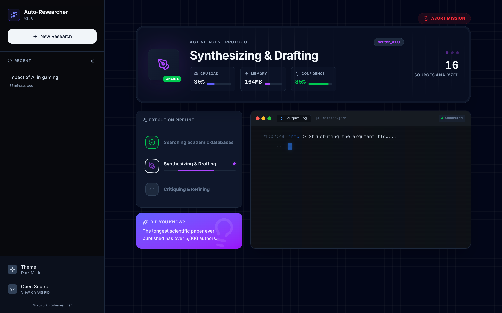
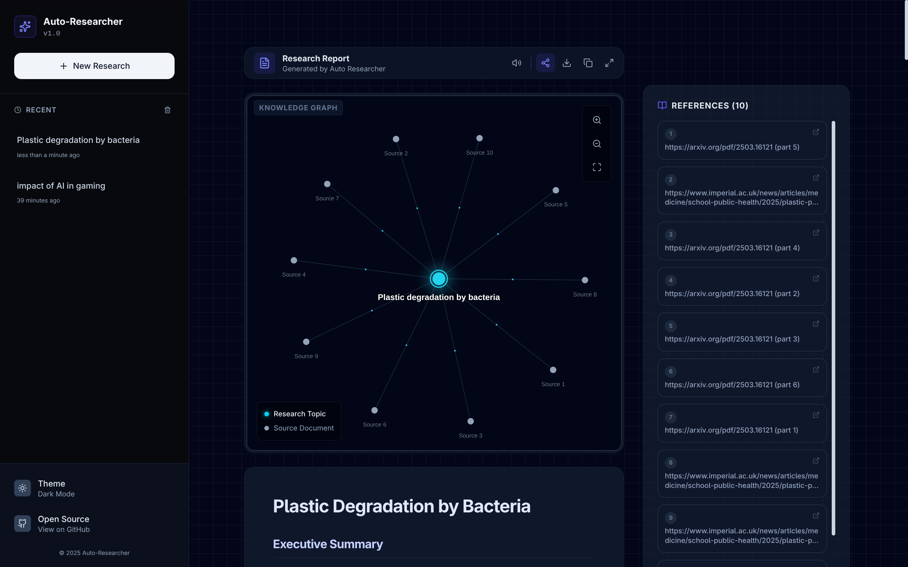

# 🎓 Auto-Researcher: Multi-Agent Collaborative System for Academic Reviews


**Auto-Researcher** is an autonomous, multi-agent system designed to revolutionize how academic literature reviews are conducted. By orchestrating a team of specialized AI agents, it performs deep research, analyzes complex academic papers, and synthesizes comprehensive reviews with verified citations.

Now featuring a **Hybrid Engine**: Run 100% locally for privacy using **Ollama**, or switch to **OpenRouter** to leverage state-of-the-art cloud models like Grok, GPT-4, or Claude.

---

## 🚀 Why Auto-Researcher?

Academic research is time-consuming. Finding relevant papers, reading them, synthesizing findings, and ensuring accuracy can take weeks. **Auto-Researcher** compresses this workflow into minutes.

### 🌟 Key Differentiators

| Feature | Auto-Researcher | Standard Chatbots (ChatGPT/Claude) | Traditional Search |
| :--- | :--- | :--- | :--- |
| **Architecture** | **Multi-Agent Loop** (Researcher → Analyst → Critic) | Single-shot generation | Manual keyword search |
| **Visibility** | **Real-time Streaming** (Watch agents think & work) | Static loading state | N/A |
| **Flexibility** | **Hybrid Engine** (Local Ollama OR Cloud OpenRouter) | Vendor Lock-in | N/A |
| **Source Truth** | **Grounded in PDFs** (Arxiv, Edu, ResearchGate) | Training data (often outdated/hallucinated) | Links only (no synthesis) |
| **Privacy** | **Local Option Available** (Ollama) | Data sent to cloud | N/A |
| **Depth** | **Iterative Refinement** (Self-Correction) | First draft only | N/A |
| **Customization** | **Adjustable Depth, Source Count & Strictness** | Fixed parameters | N/A |

---

## 🧠 How It Works

The system utilizes a **Graph-based Multi-Agent Architecture** (built with LangGraph) with **Real-time Streaming**:



1.  **🕵️‍♂️ The Researcher:**
    *   **Parallel Search:** Simultaneously queries Tavily and DuckDuckGo to maximize coverage.
    *   **Academic Filtering:** Specifically targets `arxiv.org`, `.edu`, `.ac.uk`, and `researchgate.net`.
    *   **Smart Parsing:** Downloads PDFs and extracts high-density text snippets (up to 1500 chars per section) while ignoring references/bibliographies to save context window.

2.  **✍️ The Analyst:**
    *   **High-Density Synthesis:** Drafts comprehensive reports (2400+ words for deep searches).
    *   **Thematic Grouping:** Automatically groups findings into logical themes.
    *   **Structured Output:** Generates Markdown with Executive Summary, Key Findings, Methodological Notes, and Implications.

3.  **⚖️ The Critic:**
    *   **Fact-Checking:** Reviews the draft for hallucinations and vague generalizations.
    *   **Quantitative Enforcement:** Rejects drafts that lack specific numbers/data.
    *   **Feedback Loop:** Triggers revisions if the quality score drops below the threshold (configurable via Strictness setting).

**Real-time Updates:** The backend streams events (SSE) to the frontend, allowing you to watch the agents transition between states (Researching → Drafting → Critiquing) live via a high-tech dashboard.

---

## 🛠️ Tech Stack

*   **Backend:** Python, FastAPI, LangGraph, LangChain
*   **Communication:** Server-Sent Events (SSE) for real-time streaming
*   **Frontend:** React 19, Vite, Tailwind CSS v4, Framer Motion
*   **Visualization:** React Force Graph (Interactive Knowledge Graph)
*   **LLM Engine:** 
    *   **Local:** Ollama (Llama 3, Mistral, etc.)
    *   **Cloud:** OpenRouter (Grok, GPT-4, Claude, etc.)
*   **Search:** Tavily API (Primary) + DuckDuckGo (Fallback/Supplement)
*   **PDF Processing:** PyMuPDF (Fitz) with intelligent text extraction

---

## ⚡ Getting Started

### Prerequisites
*   Python 3.10+
*   Node.js 16+
*   [Ollama](https://ollama.com/) installed and running (if using local mode)

### Installation

1.  **Clone the repository**
    ```bash
    git clone https://github.com/royxlead/auto-researcher-python.git
    cd auto-researcher-python
    ```

2.  **Setup Backend**
    ```bash
    python -m venv .venv
    source .venv/bin/activate  # Windows: .venv\Scripts\activate
    pip install -r requirements.txt
    ```

3.  **Configure Environment**
    Create a `.env` file in the root directory:
    ```env
    TAVILY_API_KEY=your_key_here  # Recommended for better search results
    
    # Local Mode Settings
    OLLAMA_BASE_URL=http://localhost:11434
    OLLAMA_MODEL=llama3:8b
    
    # Cloud Mode Settings (Optional)
    OPENROUTER_API_KEY=sk-or-...
    OPENROUTER_MODEL=x-ai/grok-4.1-fast
    ```

4.  **Start the System**
    *   **Backend:** `python run.py`
    *   **Frontend:** `cd frontend && npm install && npm run dev`

### Usage

1.  Open `http://localhost:5173` in your browser.
2.  Enter your research topic (e.g., "Impact of solid-state batteries on EV range").
3.  **Configure Research:**
    *   **Depth:** Controls the length and detail of the report (Fast / Balanced / Deep).
    *   **Papers:** Select how many sources to analyze (5 - 50).
    *   **Strictness:** Adjust the Critic's threshold for accepting drafts (Lenient / Balanced / Strict).
    *   **Provider:** Choose **Ollama** (Local) or **OpenRouter** (Cloud).
    *   **Model Name:** Specify the model (e.g., `llama3` or `x-ai/grok-4.1-fast`).
4.  Click the arrow to start. The system will visualize the research steps in real-time.
5.  **Interact:**
    *   **Read Aloud:** Use the Text-to-Speech feature to listen to the report.
    *   **Visualize:** Explore the connections between papers in the Knowledge Graph.
    *   **Export:** Download the report as a Markdown file.



---

## 🔮 Future Roadmap

*   [x] **Cloud Mode:** Optional switch to OpenRouter for heavier workloads.
*   [x] **Dark Mode:** Fully supported UI theme.
*   [x] **Visual Knowledge Graph:** Interactive node-link diagram of cited papers.
*   [x] **PDF Export:** Direct export to formatted PDF.
*   [x] **Custom Agent Personas:** Configurable "Strictness" for the Critic.
*   [x] **Text-to-Speech:** Listen to generated reports.
*   [ ] **Multi-Document Chat:** Chat with the collected sources after the review is generated.
*   [ ] **Zotero/Mendeley Integration:** Direct export to reference managers.

---

## 🤝 Contributing

Contributions are welcome! Please read our [Contributing Guide](CONTRIBUTING.md) for details on our code of conduct and the process for submitting pull requests.

## 📄 License

This project is licensed under the MIT License - see the [LICENSE](LICENSE) file for details.
