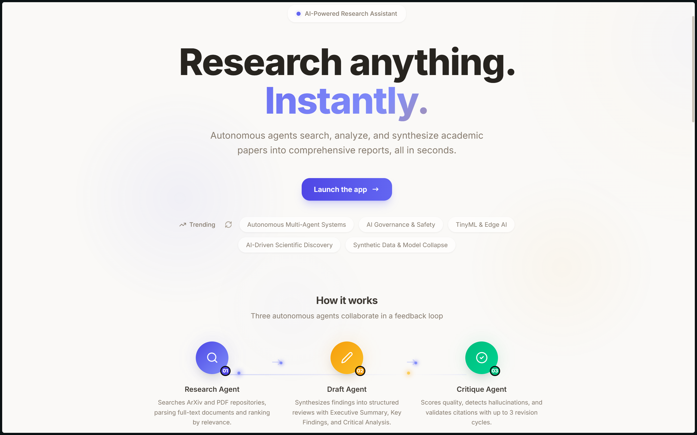
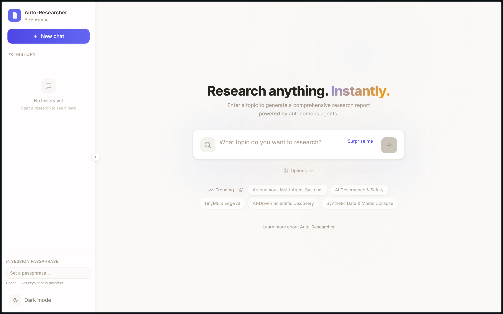
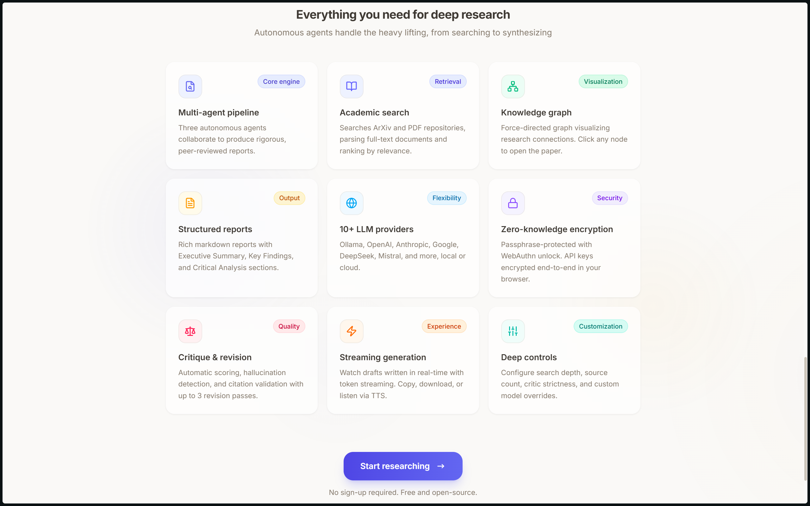

# 🔬 Auto-Researcher




**Auto-Researcher** is an autonomous, multi-agent system that performs deep academic research, analyzes complex papers, and synthesizes comprehensive reviews with verified citations. It features a **Hybrid Engine** — run 100% locally for privacy with **Ollama**, or switch to **OpenRouter** to leverage state-of-the-art cloud models.

The frontend is a polished React 19 app with animated dashboards, zero-knowledge encryption, biometric unlock, real-time streaming, and an interactive knowledge graph.

---

## ✨ What's New

- **Welcome page** — A rich marketing landing page (`/`) with hero section, animated metrics, how-it-works pipeline visualization, real-time example report preview, and feature cards
- **React Router** — Browser routing between the Welcome page (`/`) and the research app (`/app`)
- **Research queue** — Click multiple trending topics and they run sequentially instead of competing in parallel
- **Trending topics with caching** — Fetched from the backend API, cached in localStorage with a stale-while-revalidate pattern + a manual refresh button
- **Loading skeletons** — Subtle pulse-animated placeholder chips while trending topics load
- **Auto-start from URL** — Navigate to `/app?topic=X&auto=1` to kick off research immediately
- **Toast notifications** — Animated toast appears when a trending topic starts or is queued
- **Zero-knowledge encryption** — Passphrase-protected API keys with WebAuthn biometric unlock (fingerprint/Face ID/Windows Hello) and emergency recovery codes
- **Theme-aware favicon** — SVG favicon + `apple-touch-icon` for iOS that swap between light/dark variants when toggling the theme; the sidebar toggle updates both in real-time
- **Collapsible sidebar** — Compact icon-only mode with history + passphrase management
- **Brand icon** — Custom document-on-gradient SVG icon used consistently in the sidebar, favicon, and iOS home screen

---

## 🧠 How It Works

The system uses a **Graph-based Multi-Agent Architecture** (built with LangGraph) with **real-time streaming** via Server-Sent Events (SSE):



1. **🕵️ The Researcher**
   - **Parallel Search** — Simultaneously queries Tavily and DuckDuckGo for maximum coverage
   - **Academic Filtering** — Targets `arxiv.org`, `.edu`, `.ac.uk`, and `researchgate.net`
   - **Smart Parsing** — Downloads PDFs with PyMuPDF (Fitz), extracts high-density text snippets (up to 1500 chars per section), and ignores references/bibliographies to save context window

2. **✍️ The Analyst**
   - **High-Density Synthesis** — Drafts comprehensive reports (2400+ words for deep searches)
   - **Thematic Grouping** — Automatically organizes findings into logical themes
   - **Structured Output** — Generates Markdown with Executive Summary, Key Findings, Methodological Notes, and Implications

3. **⚖️ The Critic**
   - **Fact-Checking** — Reviews the draft for hallucinations and vague generalizations
   - **Quantitative Enforcement** — Rejects drafts that lack specific numbers and data
   - **Feedback Loop** — Triggers up to 3 revision cycles if the quality score drops below the configured threshold

**Real-time Streaming:** The backend pushes events (SSE) so you can watch agents transition live — Researching → Drafting → Critiquing — as they work.



---

## 🛠️ Tech Stack

| Layer | Technology |
| :--- | :--- |
| **Backend** | Python, FastAPI, LangGraph, LangChain |
| **Streaming** | Server-Sent Events (SSE) |
| **Frontend** | React 19, Vite, TypeScript |
| **Styling** | Tailwind CSS v4, Framer Motion |
| **Graphs** | React Force Graph (2D) |
| **Routing** | React Router v7 |
| **LLM Engine (Local)** | Ollama (Llama 3, Mistral, etc.) |
| **LLM Engine (Cloud)** | OpenRouter (Grok, GPT-4, Claude, DeepSeek, etc.) |
| **Search** | Tavily API + DuckDuckGo fallback |
| **PDF** | PyMuPDF (Fitz) |
| **Auth** | WebAuthn PRF (biometric unlock) + PBKDF2 encryption |

---

## ✨ Features

| Feature | Description |
| :--- | :--- |
| **Multi-agent pipeline** | Three autonomous agents collaborate in a feedback loop with up to 3 revision passes |
| **Academic search** | Searches ArXiv and PDF repositories, parses full-text documents, ranks by relevance |
| **Knowledge graph** | Interactive force-directed graph of cited papers — click any node to open the source |
| **Structured reports** | Rich Markdown with Executive Summary, Key Findings, Critical Analysis |
| **10+ LLM providers** | Ollama, OpenAI, Anthropic, Google, DeepSeek, Mistral, and more — local or cloud |
| **Zero-knowledge encryption** | Passphrase-protected with WebAuthn biometric unlock. API keys encrypted end-to-end in your browser |
| **Critique & revision** | Automatic scoring, hallucination detection, and citation validation |
| **Streaming generation** | Watch agents work in real-time; copy, download, or listen via TTS |
| **Deep controls** | Configure search depth, source count, critic strictness, and custom model overrides |
| **Research queue** | Click multiple topics and they run sequentially — no parallel conflicts |
| **Trending topics** | Fetch trending research topics from the API with localStorage caching and manual refresh |
| **Dark mode** | Full theme support persisted to localStorage, with a toggle in the sidebar |
| **Collapsible sidebar** | Compact mode with history browsing and passphrase management |
| **Biometric unlock** | Fingerprint, Face ID, or Windows Hello via WebAuthn PRF extension |
| **Emergency recovery** | 5-word recovery codes backed by PBKDF2 with 600K iterations |
| **Toasts & skeletons** | Animated toast notifications and subtle loading placeholders |

---

## ⚡ Getting Started

### Prerequisites

- Python 3.10+
- Node.js 18+
- [Ollama](https://ollama.com/) installed and running (for local mode)

### Installation

```bash
# Clone the repository
git clone https://github.com/royxlead/auto-researcher-python.git
cd auto-researcher-python

# Setup Backend
python -m venv .venv
source .venv/bin/activate  # Windows: .venv\Scripts\activate
pip install -r requirements.txt

# Setup Frontend
cd frontend
npm install
```

### Configuration

Create a `.env` file in the project root:

```env
TAVILY_API_KEY=your_key_here

# Local Mode
OLLAMA_BASE_URL=http://localhost:11434
OLLAMA_MODEL=llama3:8b

# Cloud Mode (Optional)
OPENROUTER_API_KEY=sk-or-...
OPENROUTER_MODEL=x-ai/grok-4.1-fast
```

### Running

```bash
# Terminal 1 — Backend
python run.py

# Terminal 2 — Frontend
cd frontend && npm run dev
```

Open `http://localhost:5173` in your browser. The Welcome page greets you with a live dashboard, example report preview, and feature overview. Click **Launch the app** or navigate to `/app` to start researching.

### Usage

1. Enter a research topic (e.g., *"Impact of solid-state batteries on EV range"*)
2. Configure your research:
   - **Depth** — Fast / Balanced / Deep
   - **Papers** — 5–50 sources
   - **Strictness** — The Critic's threshold (Lenient / Balanced / Strict)
   - **Provider** — Ollama (local) or OpenRouter (cloud)
   - **Model** — Custom model name override
3. Click the arrow to start — watch agents work in real-time
4. Interact with the report:
   - **Read Aloud** — Text-to-Speech
   - **Visualize** — Explore the Knowledge Graph
   - **Export** — Download as Markdown

#### Trending Topics

Click any trending topic chip to instantly kick off research. Click multiple and they queue up. The refresh button (`↻`) fetches updated topics from the API.

#### Passphrase & Biometric Unlock

Set a passphrase in the sidebar to encrypt your API keys end-to-end. Optionally register a biometric credential (fingerprint, Face ID, Windows Hello) for one-tap unlock on repeat visits. If you lose access, use your 5-word emergency recovery code.

---

## 🗺️ Project Structure

```
auto-researcher-python/
├── run.py                  # Backend entry point (uvicorn)
├── requirements.txt
├── src/
│   ├── api.py              # FastAPI routes + SSE streaming
│   ├── config.py           # Environment configuration
│   ├── schemas.py          # Pydantic models
│   ├── agents/
│   │   ├── graph.py        # LangGraph workflow definition
│   │   ├── nodes.py        # Agent node functions
│   │   └── state.py        # Graph state schema
│   ├── tools/
│   │   ├── search.py       # Tavily + DuckDuckGo search
│   │   ├── pdf.py          # PDF download + parsing (PyMuPDF)
│   │   ├── ranking.py      # Source relevance ranking
│   │   ├── validation.py   # Citation validation
│   │   └── graph.py        # Knowledge graph extraction
│   ├── evaluation/
│   │   └── retrieval.py    # Retrieval evaluation
│   └── utils/
│       ├── crypto.py       # Server-side crypto helpers
│       └── tracing.py      # LangSmith tracing
├── frontend/
│   ├── index.html           # HTML with favicon + apple-touch-icon
│   ├── src/
│   │   ├── main.tsx         # React entry + BrowserRouter
│   │   ├── App.tsx          # Research app (route: /app)
│   │   ├── pages/
│   │   │   └── Welcome.tsx  # Marketing landing page (route: /)
│   │   ├── components/
│   │   │   ├── Sidebar.tsx       # Collapsible nav + passphrase mgmt
│   │   │   ├── ResearchForm.tsx  # Topic input + config controls
│   │   │   ├── ReportView.tsx    # Report viewer + Knowledge Graph
│   │   │   ├── LoadingState.tsx  # Real-time progress dashboard
│   │   │   ├── KnowledgeGraph.tsx # Force-directed citation graph
│   │   │   ├── ErrorBoundary.tsx # Error fallback UI
│   │   │   └── BrandIcon.tsx     # SVG brand icon component
│   │   ├── hooks/
│   │   │   └── useResearch.ts    # Research state + queue logic
│   │   └── lib/
│   │       ├── api.ts            # API client + trending cache
│   │       ├── crypto.ts         # AES-256-GCM + PBKDF2 encryption
│   │       ├── webauthn.ts       # WebAuthn PRF biometric unlock
│   │       └── favicon.ts        # Dynamic theme-aware favicon swap
│   └── package.json
└── assets/
    ├── HomeScreen.png
    ├── SearchScreen.png
    └── Features.png
```

---

## 🔮 Roadmap

- [x] **Cloud Mode** — OpenRouter for heavier workloads
- [x] **Dark Mode** — Full theme support with localStorage persistence
- [x] **Knowledge Graph** — Interactive node-link diagram of cited papers
- [x] **Zero-knowledge encryption** — Passphrase + WebAuthn biometric unlock
- [x] **Trending topics** — API-fetched, cached, with refresh button
- [x] **Research queue** — Sequential topic processing
- [x] **Welcome page** — Marketing landing page with live metrics
- [x] **Theme-aware favicon** — Dynamic light/dark SVG icon
- [x] **Sidebar collapse** — Compact icon-only mode
- [ ] **Multi-document chat** — Chat with collected sources
- [ ] **Zotero / Mendeley integration** — Direct export to reference managers
- [ ] **PDF export** — Download reports as formatted PDF

---

## 🤝 Contributing

Contributions are welcome! Please open an issue or submit a pull request.

## 📄 License

MIT — see [LICENSE](LICENSE).
